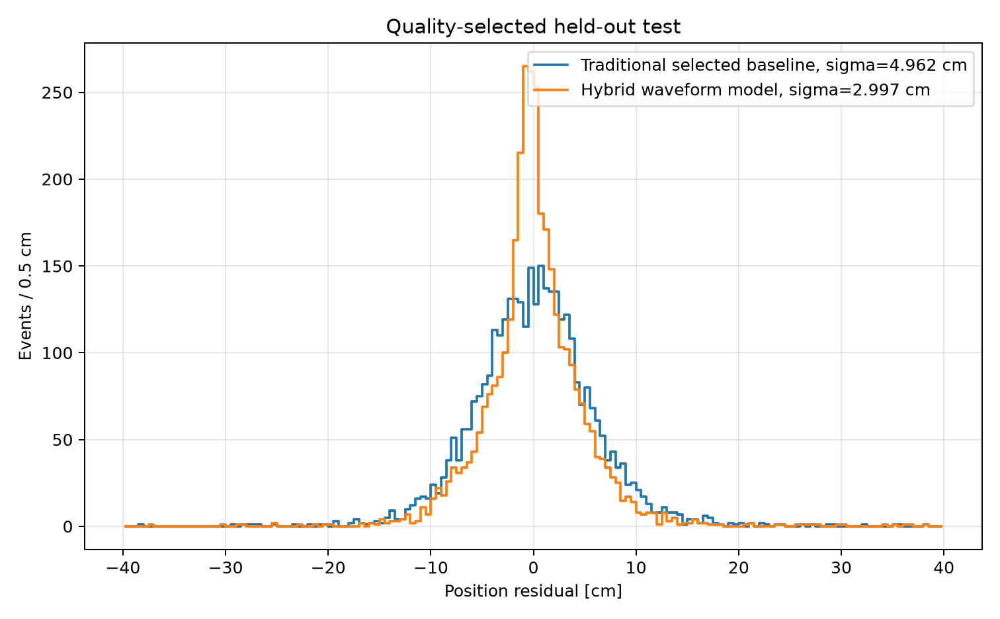
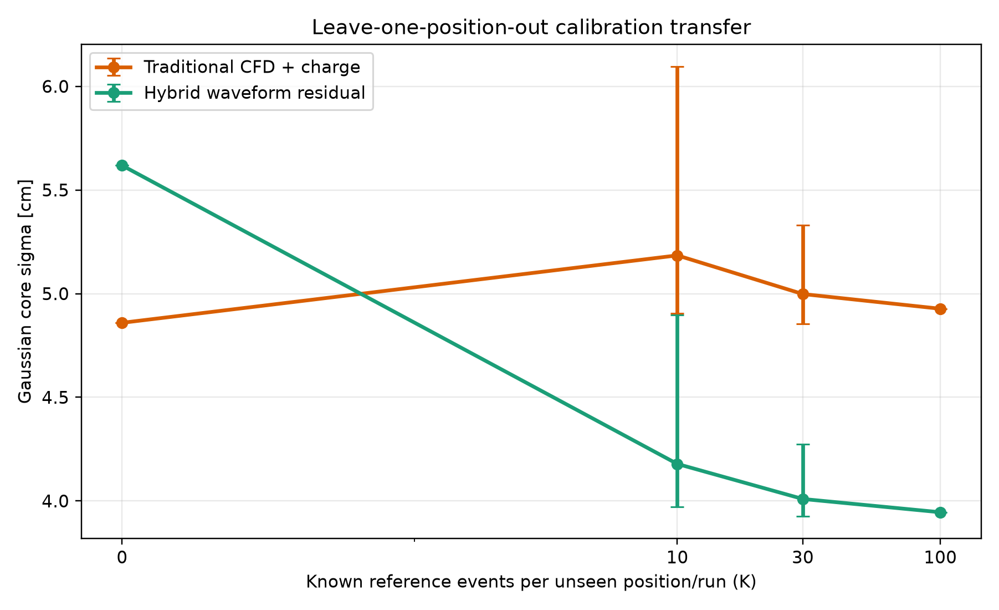
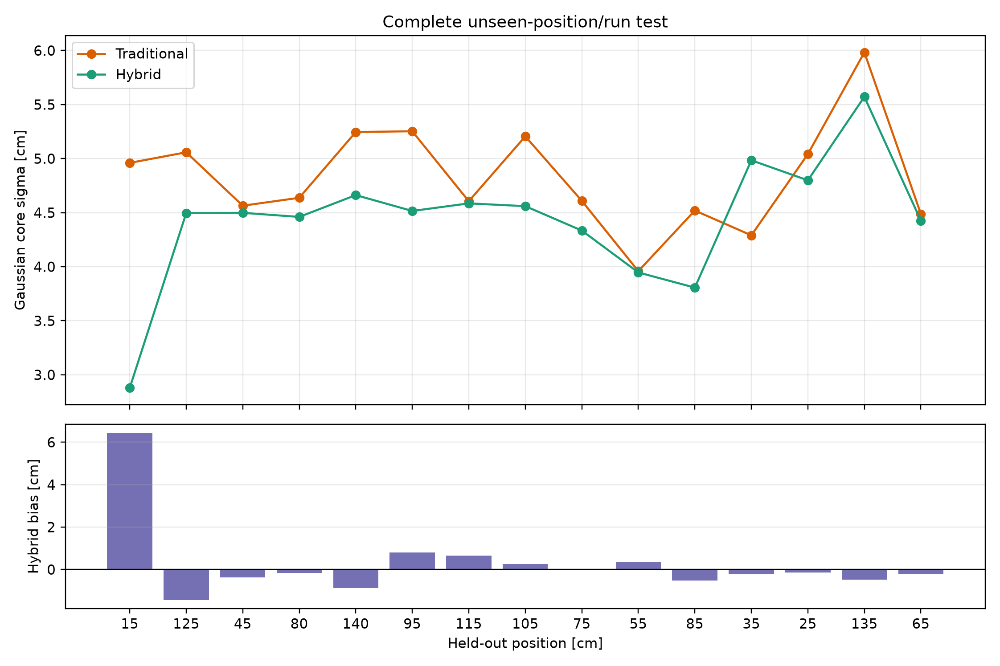
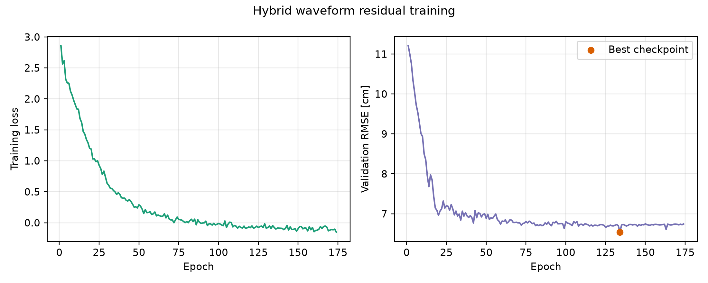

# TOF シンチレータ波形再構成：結果報告

本書は、完了済みの固定された結果ファイルから自動生成したものです。本書の生成時には再学習、データ分割の変更、波形データの再処理を行っていません。

## 指標とデータ範囲

主指標は位置残差の Gaussian core width（`sigma`、単位 cm）です。大場卒業論文の公開結果と同じ指標であり、中心的な位置分解能を表します。RMSE は外れ値に敏感な補助指標であり、`sigma` と直接比較しません。

提供された raw archive から再現できるデータは 23,602 events です。本報告のすべての再現実験はこのデータを用います。

## 従来法の基準

| 条件 | Gaussian sigma [cm] | 意味 |
| --- | ---: | --- |
| 大場卒業論文の公開 CFD + 電荷融合 | 4.93 | 公開された従来法の基準 |
| 大場氏の非公開・品質選別後の結果 | 4.72 | 過去の参考値。正確な選別規則は未入手 |
| CFD + 電荷融合の再現、ROI 450:800 | 4.860 | 提供 raw archive 上での再現値 |
| 品質選別を訓練/検証/テストで分離した従来法 | 4.683 | 約 79% の高品質事象を保持した独立テスト値 |

再現値は公開値 4.93 cm と整合し、新手法との比較基準として利用できます。

## Hybrid waveform residual model

Hybrid は同じ従来法の位置推定値を基準とし、2 チャンネル波形 ROI と非ラベル物理特徴量から残差のみを学習します。位置ラベルは教師値であり、入力特徴量には含めません。

### 同一位置分布での補助的な残差図

この図は各位置を train/validation/test に含める同一分布の独立テストであり、未知位置への転移性能を示す主図ではありません。

### 未知位置/run への転移評価

各テスト位置/run は、従来法の校正、モデル訓練、validation のすべてから除外します。新しい位置では、最初の `K` 個の位置既知 reference events により定数オフセットのみを推定し、それ以降の事象で評価します。従来法と Hybrid は同一の reference events を使用します。

| 位置ごとの reference events K | 従来法 sigma [cm] | Hybrid sigma [cm] | 従来法 - Hybrid [cm] | 改善量の 95% 区間 | P(Hybrid が良い) |
| ---: | ---: | ---: | ---: | --- | ---: |
| 0 | 4.859 | 5.618 | -0.759 | [-0.759, -0.759] | 0.000 |
| 10 | 5.185 | 4.178 | 1.002 | [0.616, 1.421] | 1.000 |
| 100 | 4.927 | 3.945 | 0.982 | [0.982, 0.982] | 1.000 |

## 主張の範囲

- `K=0`、すなわち新しい位置ごとの参照校正なしでは、従来法の方が頑健です。Hybrid には絶対位置の転移バイアスがあり、ゼロ校正の置換法とは主張しません。
- 新しい位置/run ごとに 10 個の位置既知 reference events を用いると、500 回の再標本化すべてで Hybrid が従来法より良い分解能を示しました。
- `K=100` では Hybrid は 3.945 cm に達します。これは、ここで定義した校正転移プロトコルの下で、公開値 4.93 cm と過去の参考値 4.72 cm のいずれも下回ります。

## 小数の reference events が必要な理由

次図は leave-one-position-out の全 fold を示します。下段は reference 校正をしない Hybrid の絶対位置バイアスです。このバイアスのため `K=0` では従来法より悪くなります。一方で、位置ごとの定数オフセットを少数事象で補正すると、Hybrid の局所的な波形分解能が現れます。

## 論文化・共有時に同梱する資料

1. 本報告書と上記 2 図。
2. 元となる固定 JSON metrics：`/home/m78code/HEP_Project/Scintillator_Project/results/ohba_all_usable_leave_one_position_out/calibration_transfer/calibration_reference_resampling.json`、`/home/m78code/HEP_Project/Scintillator_Project/results/ohba_all_usable_leave_one_position_out/position_holdout_offset_audit.json`。
3. モデル構造、波形 ROI (450:800)、入力特徴量、optimizer、early stopping、seed、分割規則。
4. 代表的な train/validation learning curve。

この learning curve は性能比較に使用した固定 protocol を変更せず、収束過程を文書化する目的で追加した代表 run です。
5. 良い結果だけでなく `K=0` の負の結果も含めます。

## 結論

波形残差学習は CFD + 電荷融合をゼロ校正で置き換える万能法ではありません。しかし、新しい位置/run ごとの少数の reference events による定数オフセット校正を許すなら、再現した従来法より統計的に安定して小さい Gaussian-core 位置分解能を達成します。
